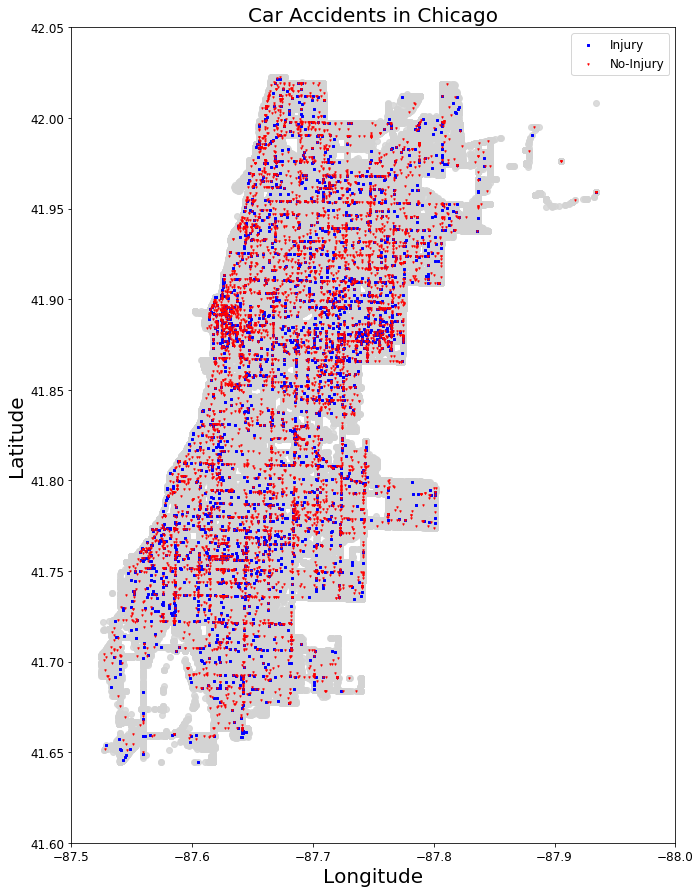
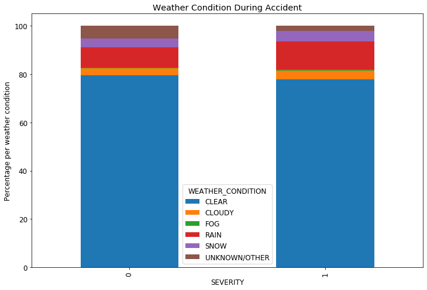
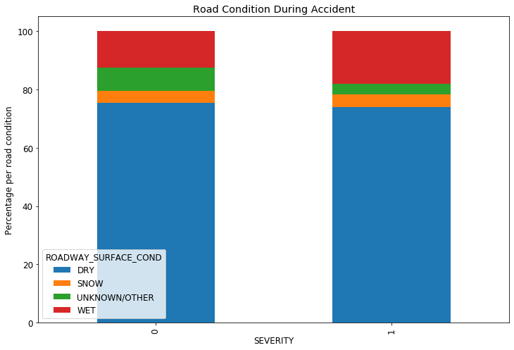
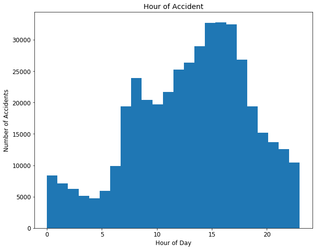
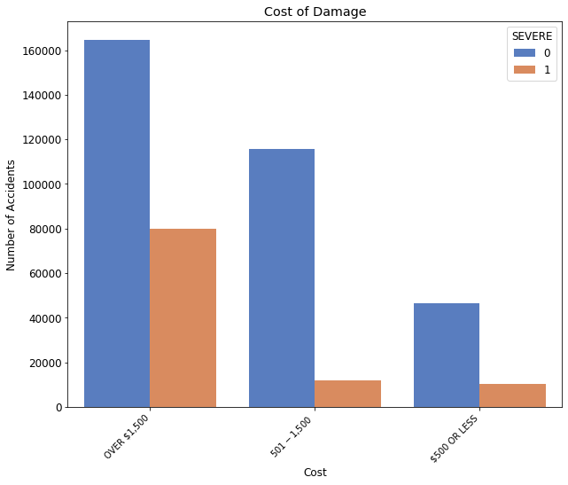
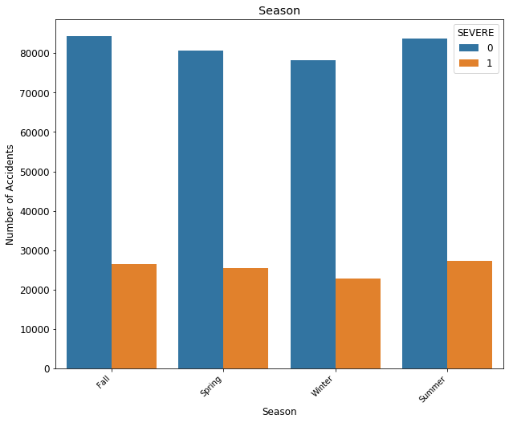

# Car Accidents Injury Predictions
By: Jagandeep Singh & Yehuda Schein

## Introduction
We are using "Chicago Car Crash Dataset." This dataset initially had 431257 rows.
The dataset included date and time, number of cars involved, weather condition,
road condition, traffic way type, etc. We are predicting the severity of an accident.\

## Data Cleaning
The dataset initially had 431257 rows and 49 columns. Most of the columns were
not useful for our model so we ended up keeping only 23 columns. A few hundred
rows had nan values but since our data set had 400 thousand observation, we removed
all the rows with nan values. After data cleaning we were left with 430398 rows.

The dataset can be found here:\
https://data.cityofchicago.org/Transportation/Traffic-Crashes-Crashes/85ca-t3if

## Hypothesis tests
We performed two hypothesis tests on the data.
1. To check if the proportion of Severe Accidents is equal in Clear, Wet and Snow Weather Conditions.\

2. To check if the proportion of Severe Accidents is equal in Dry, Snow and Wet Road Conditions.\

## Data Analysis and Visualization
In our analysis, we checked the hour of accidents. Most accidents occur during the
morning and evening rush hour. Then we looked at the severity of an accident with
the road condition and Weather condition at the time of accident. Then we looked at
the number of severe and non severe accidents in different seasons.\

## Models
We ran couple different models on the data. We checked for multicollinearity within
different features and removed those features. We ran a logistic regression model
as our basic model. Then we used Lasso to do some more feature selection, but it
removed most of our features, so we ended up not using lasso feature selection.
Then we tried Logistic with balanced class weight which gave us the best f1 score
of all. We tried Decision Tree, Random Forest, Grid search with different models,
XG Boost. The best F1 score we got was with Logistic regression with balanced class
weight. We used Logistic Regression as our Final model.

## Conclusion
Our final models show that certain columns have more of an effect on the severity
of a car accident than others. For example, accidents where pedestrians are
involved have are more likely to be severe than accidents where there is just a
side swipe. A few examples of this is accidents with pedestrians, cyclists or
where the driver is going above the authorized speed limit. An example of a feature
where there is a negative correlation with having a severe accident is when there
is either a same direction or opposite direction sideswipe.\
One application where this prediction and our model could be considered is with
the addition of self driving cars. When an accident occurs, the car will know and
immediately notify the EMTs. This notification can also include what features were
involved in the accident (i.e. pedestrian, sideswipe, speeding etc.)  and be able
to conclude whether or not this accident is severe and how much attention it needs.

Here is the link to our presentation:\
https://docs.google.com/presentation/d/1A5nPFqrnkGodolwsg-AYhul6f0UhpoYbqCpimEwe1uY/edit?usp=sharing
